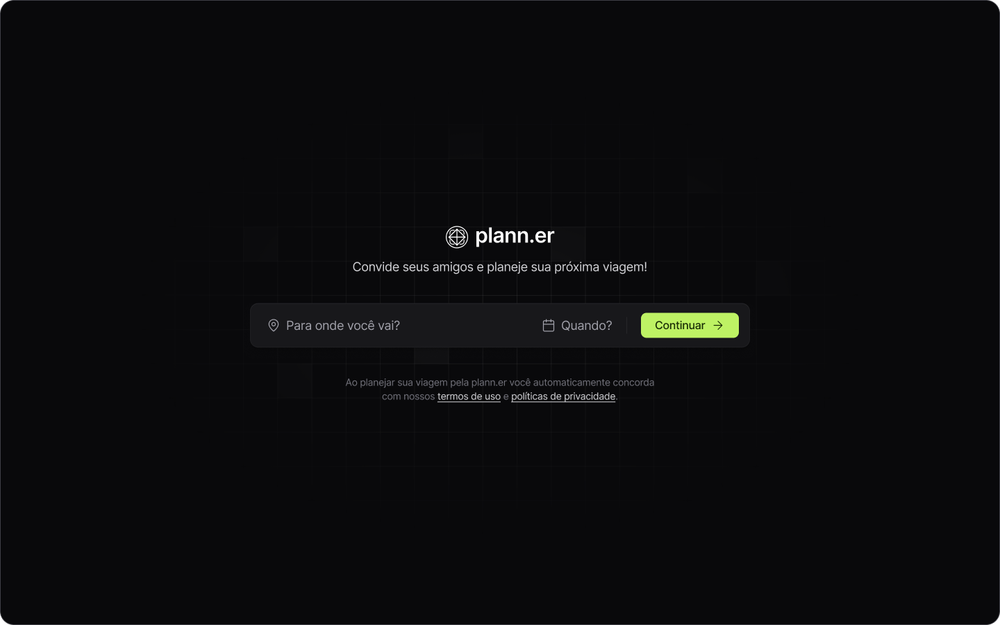

# Trip Planner



## Description
The **Trip Planner** is an application that facilitates the organization of group trips. The application allows organizers to create a trip, add activities, and invite participants via email. Guests can access a link to view group activities, store important links such as Airbnb and tickets, and confirm their attendance on the participants' list.


## Features
- Creation of trips with dates and times.
- Addition of group activities.
- Sending email invitations to participants.
- Link for guests to view trip activities.
- Space to store important links such as Airbnb and tickets.
- Participants list with attendance confirmation.

## Technologies Used
- **Front-end:** React.js, Tailwind CSS
- **Back-end:** Node.js, Express

## Installation

1. Clone the repository:
   ```bash
   git clone https://github.com/ogustavohp/trip-planner.git
   cd trip-planner
   ```
   
2. Install backend dependencies:
   ```bash
   cd backend
   npm install
   ```
   
3. Create a .env file in the backend folder and add required environment variables.
   
5. Install frontend dependencies:
   ```bash
   cd backend
   npm run dev
   ```
   
6. Start the frontend server:
   ```bash
   cd web
   npm run dev
   ```
